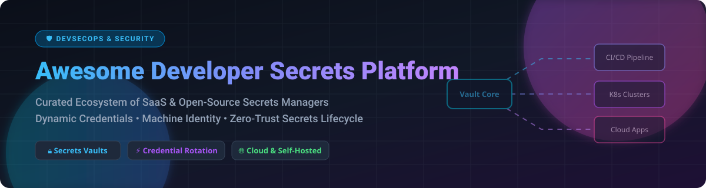

# 🔒 Awesome Developer Secrets Platform

  
  
  
  
  
  
  

## 🚀 Top Developer Secrets Platform Ecosystem

**Curated List of SaaS Products & Open-Source GitHub Projects for Developer Secrets Management, Credential Rotation, Dynamic Secrets, & Machine Identity Security**

*Last updated: October 2026*

---

### 💡 Overview & SEO Keywords

This repository tracks notable **SaaS platforms** and **open-source projects** for **Developer Secrets Management**. These tools securely store, rotate, scan, and inject secrets (API keys, database credentials, TLS certificates, OAuth tokens) into applications, CI/CD pipelines, Kubernetes clusters, and cloud infrastructure while providing granular access control, zero-trust authentication, and full compliance audit trails.

**Core Categories & Use Cases:**
- 🔐 **Secrets Management & Vaulting**: Centralized storage for sensitive application environment variables and credentials.
- ⚡ **Dynamic Credentials & Auto-Rotation**: Short-lived, just-in-time API keys and database credentials to eliminate static secret risks.
- ⚙️ **GitOps & Kubernetes Secrets Encryption**: Native tools (SOPS, Sealed Secrets, External Secrets Operator) for encrypted infrastructure code.
- 🛡️ **Machine Identity & Zero Trust**: Cryptographic workload identity (SPIFFE/SPIRE, mTLS, Service Accounts).

---

## 📋 Table of Contents

- [☁️ SaaS / Hosted Platforms](#%EF%B8%8F-saas--hosted-platforms)
- [🔓 Open-Source GitHub Projects](#-open-source-github-projects)
- [🤝 How to Contribute](#-how-to-contribute)
- [☕ Support & Sponsorship](#-support--sponsorship)
- [📈 Star History](#-star-history)
- [⚠️ Disclaimer](#%EF%B8%8F-disclaimer)

---

## ☁️ SaaS / Hosted Platforms

> 📊 **Market Insights**: The global Developer Secrets Management and Machine Identity Security market is estimated at **$2.5 Billion to $5.2 Billion**, expanding at a **22%+ CAGR**. The sector is **moderately fragmented**, contested between cloud hyperscalers (AWS, Azure, GCP) providing cloud-native key vaults and specialized developer-first platforms (HashiCorp, Infisical, Doppler, CyberArk) competing on developer experience, zero-trust rotation, and multi-cloud sync.

| 🏢 Platform | 💰 Company Size / Valuation | 🏷️ Starting Paid Price | 🎁 Free Tier / Free Trial Limits | 🌟 Key Highlights & Differentiators |
| :--- | :--- | :--- | :--- | :--- |
| **[Azure Key Vault](https://azure.microsoft.com/en-us/products/key-vault)** | ~$3.0 Trillion Market Cap (Microsoft) / $245B+ Revenue | **$0.03 per 10,000 operations** (Standard secrets/keys; $0 base monthly fee) | **$200 free credits** (30-day trial via Azure Free Account; no permanent free operations) | Azure-native service combining secrets, keys, and certificates with Managed Identity integration. HSM-backed keys in Premium tier. |
| **[Google Secret Manager](https://cloud.google.com/secret-manager)** | ~$2.1 Trillion Market Cap (Alphabet) / $330B+ Revenue | **$0.06 per active secret version/mo** + **$0.03 per 10,000 operations** | **6 active secret versions, 10,000 access operations, 3 rotation notifications free/mo** (+ $300 trial credits) | GCP-native secrets store with automatic versioning, audit logging, and Workload Identity support for GKE/Cloud Run. |
| **[AWS Secrets Manager](https://aws.amazon.com/secrets-manager/)** | ~$2.0 Trillion Market Cap (Amazon) / $600B+ Revenue | **$0.40 per secret/month** + **$0.05 per 10,000 API calls** | **30-day free trial** (up to 10,000 API calls & 10 secrets; no permanent free tier) | AWS-native secrets store with automated credential rotation for RDS/Redshift/DocumentDB and cross-region replication. |
| **[CyberArk Conjur Enterprise](https://www.cyberark.com/)** | $25 Billion Valuation (Acquired by Palo Alto Networks) / $1.3B Revenue | **~$15,000/year** starting enterprise contract (Quote-based) | **30-day enterprise evaluation trial** (No permanent free SaaS tier; Conjur OSS is free self-hosted) | Enterprise Policy-as-Code secrets management with strong mTLS Kubernetes authenticators and CI/CD JWT authentication. |
| **[1Password Secrets Automation](https://www.1password.dev/secrets-automation)** | $6.8 Billion Valuation / $400M+ ARR | **$7.99 per user/month** (Business plan; Starter Pack $19.95/mo for 10 users) | **14-day free trial** (Includes unlimited self-hosted Connect servers & service accounts; no permanent free tier) | Infrastructure secrets automation via Service Accounts and Connect servers; included in 1Password business subscriptions. |
| **[HashiCorp Vault (HCP)](https://www.hashicorp.com/products/vault)** | $6.4 Billion Valuation (Acquired by IBM) / $655M Revenue | **$0.03/hour (~$22/month)** (Dev cluster) / Essentials from **$0.62/hour (~$450/month)** | **$500 free trial credits** on HCP platform (Vault Community Edition is free self-hosted) | Industry-standard reference implementation featuring dynamic secrets, PKI, transit encryption, and extensive plugin engine. |
| **[Keeper Secrets Manager](https://www.keepersecurity.com/)** | ~$1.5 Billion+ Valuation / $225M+ ARR | **$3.75 per user/month** (Business tier) / Dedicated secret volume tiers starting ~$1,200/year | **14-day free trial** (No permanent free secrets manager tier; free personal password tier only) | Zero-knowledge enterprise password and secrets management with dark web monitoring (BreachWatch) and granular PAM policies. |
| **[Akeyless](https://www.akeyless.io/)** | ~$200 Million Valuation ($76M+ Total Funding / ~$18M ARR) | **$250/month** (Starter Plan) | **Free Forever plan** (Limits: up to 5 clients, 500 static secrets, 5 dynamic/rotated secrets, 1 TLS/SSH issuer) | Zero-knowledge SaaS platform built on Distributed Fragments Cryptography (DFC), providing dynamic secrets, rotation, and BYOK. |
| **[Infisical (Cloud)](https://infisical.com/)** | ~$60 Million Valuation ($19.3M Total Funding / Series A) | **$20 per identity/month** (billed annually, Pro plan) | **Free Forever plan** (Limits: up to 5 identities, unlimited projects, 100+ turnkey integrations) | Developer-first open-source secrets platform featuring CLI, SDKs, secret leak scanning, dynamic secrets, and self-hosting options. |
| **[Doppler](https://www.doppler.com/)** | ~$45 Million Valuation ($28.9M Total Funding) | **$7 per user/month** (billed annually, Team plan) | **Free Developer plan** (Limits: up to 3 users, 10 projects, 4 environments per project, 3 days log retention) | Cloud secrets manager with best-in-class developer UX, multi-environment sync, and standby dual-credential zero-downtime rotation. |

---

## 🔓 Open-Source GitHub Projects

*Sorted descending by GitHub Star count.*

- **[HashiCorp Vault](https://github.com/hashicorp/vault)**   
  The industry-standard open-source secrets engine. Go-based. Provides dynamic secrets (minting short-lived unique credentials), PKI engine, transit data encryption, and extensive plugin architecture. **Trade-off**: Requires dedicated operational overhead for HA clustering and unseal procedures.

- **[Infisical](https://github.com/Infisical/infisical)**   
  The leading modern open-source secrets platform. Self-hostable without artificial usage caps. Features dynamic credentials, secret leak scanning, PKI/SSH certificate management, and Access Request approval workflows. Includes developer-friendly CLI, SDKs, and Kubernetes operators.

- **[SOPS (Secrets OPerationS)](https://github.com/getsops/sops)**   
  Editor for encrypted files supporting YAML, JSON, ENV, INI, and BINARY formats. Encrypts values while keeping keys unencrypted. Integrates with AWS KMS, GCP KMS, Azure Key Vault, Age, and PGP. Ideal for storing encrypted secrets directly in Git repositories.

- **[git-secrets (AWS Labs)](https://github.com/awslabs/git-secrets)**   
  CLI tool that prevents accidental commits of credentials, API keys, and passwords by scanning staged files and commit messages against configurable regex patterns.

- **[Sealed Secrets (Bitnami)](https://github.com/bitnami-labs/sealed-secrets)**   
  Kubernetes-native secret encryption for GitOps. Encrypts Kubernetes Secrets into `SealedSecret` custom resources that are safe to store in public version control and can only be decrypted by the controller running inside the cluster.

- **[aws-vault (99designs)](https://github.com/99designs/aws-vault)**   
  Secure CLI credential manager for AWS developers. Stores long-term AWS credentials in operating system keychains (macOS Keychain, Windows Credential Manager, Secret Service) and generates temporary STS credentials for shell sessions.

- **[OpenBao](https://github.com/openbao/openbao)**   
  Community-driven open-source fork of HashiCorp Vault under Linux Foundation governance. Focuses on maintaining an open, MPL-2.0 licensed secrets vault ecosystem for dynamic secrets, transit encryption, and PKI.

- **[gopass](https://github.com/gopasspw/gopass)**   
  Terminal-based team password and secret manager written in Go. Uses GPG or Age encryption with Git synchronization, enabling tree-structured password vaults with granular team sharing.

- **[External Secrets Operator](https://github.com/external-secrets/external-secrets)**   
  Kubernetes operator that integrates external secret management systems (Vault, AWS Secrets Manager, GCP Secret Manager, Azure Key Vault, 1Password) into native Kubernetes `Secret` resources.

- **[git-secret](https://github.com/sobolevn/git-secret)**   
  Bash-based CLI tool to store private data inside Git repositories. Uses GPG encryption to encrypt sensitive files so only authorized committers can decrypt them.

- **[Teller](https://github.com/tellerops/teller)**   
  A portable secrets manager for developers. Pulls, syncs, and injects environment variables across multiple secret providers (AWS, HashiCorp Vault, 1Password, Doppler, dotenv) into application processes without writing secrets to disk.

- **[Blackbox (StackExchange)](https://github.com/StackExchange/blackbox)**   
  VCS-agnostic secret management using GPG subkeys. Safely encrypts specific files in Git, Mercurial, or SVN repositories for deployment automation and developer collaboration.

- **[SPIRE (SPIFFE Runtime Environment)](https://github.com/spiffe/spire)**   
  Reference implementation of the SPIFFE APIs. Provides zero-trust cryptographic workload identity across multi-cloud and container environments, solving the root identity bootstrapping problem for secrets access.

- **[CyberArk Conjur Open Source](https://github.com/cyberark/conjur)**   
  Open-source secrets management engine featuring declarative Policy-as-Code (YAML), mTLS Kubernetes authenticators, and JWT authentication for CI/CD pipelines (GitHub Actions, GitLab CI).

---

## 🤝 How to Contribute

Contributions are warmly welcome! Help us keep this directory accurate, comprehensive, and up-to-date.

1. 🍴 Fork the repository.
2. 📝 Add or update entries in `README.md` following the existing tabular and list formats.
3. 🔒 Provide factual details (Name, link, description, pricing, free limits, or star counts).
4. 🚀 Open a Pull Request with a clear summary of changes.

Check out our reference awesome list: [Awesome-Awesome-Awesome](https://github.com/ishandutta2007/Awesome-Awesome-Awesome)!

---

## ☕ Support & Sponsorship

If you find this repository valuable for your security architecture, DevSecOps workflows, or platform engineering research:

- ⭐ **Star this repository** to help others discover it!
- 🔀 **Fork & Share** with your team and security network.
- 💖 **Sponsor the Project**: Consider buying me a coffee or sponsoring ongoing open-source maintenance via [GitHub Sponsors](https://github.com/sponsors/ishandutta2007)!

  

---

## 📈 Star History

---

## ⚠️ Disclaimer

- This list is **community-curated** for educational and research purposes — not an explicit endorsement.
- Secrets management systems handle high-value infrastructure credentials. Self-hosted deployments require continuous security hardening, key unsealing procedures, HA configurations, and automated backup routines.
- SaaS platforms introduce third-party risk into your credential path; audit compliance certifications (SOC 2, ISO 27001) and encryption key architecture (BYOK / zero-knowledge) before production adoption.

---

  <b>Made with ❤️ for Security Engineers, Platform Teams, DevOps Practitioners, and Developers.</b>

